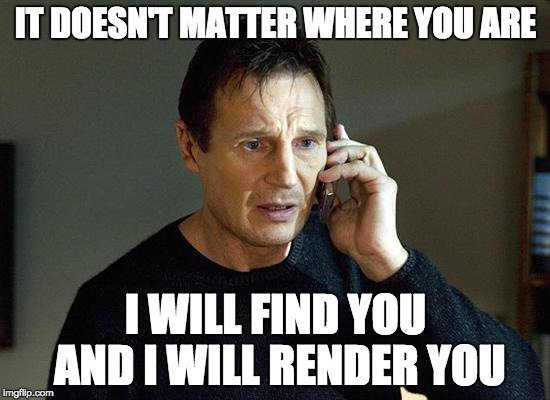

# React intro

## Learning Objectives
- How to create a basic JavaScript application using React
- How to use the package `create-react-app` to start developing quickly with React
- What JSX is and how to use it
- How to use the React Developer Tools to debug your code
- How to use Enzyme's Shadow rending to test your application
- How to use React with Webpack & Babel
